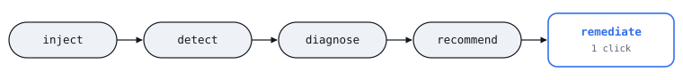

# AI Sentinel

**AI Sentinel is a reliability engine for AI services.** It watches a live AI pipeline, detects when
it degrades, works out *which stage* caused it, recommends a fix you approve with one click, then
verifies the fix actually worked and rolls it back if it didn't. Its diagnosis is graded by a blind
fault-injection eval, where the fault is withheld from the code being tested. Across four 50-trial
runs it went from 68% to 98%, and the eval itself is what exposed a bug in the detector's baseline
logic (see [Evidence](#evidence) for what that number does and doesn't prove).

It's built around a small instrumented demo AI service, so the whole loop is runnable and
demoable, not just described. Try it in one command (needs [`uv`](https://docs.astral.sh/uv/)):
`uv sync && ./scripts/run_demo.sh`



**Architecture, in diagrams:** see [`docs/DIAGRAMS.md`](docs/DIAGRAMS.md) for all eleven diagrams and
[`docs/ARCHITECTURE.md`](docs/ARCHITECTURE.md) for the full write-up, or the
[rendered version](https://claude.ai/artifact/6CK9V5RV3fi4WhjNauvZnG) with the same content.

## Evidence

Claims that are actually checked, not just described:

- **138 automated tests**, passing both locally and on a persistent deployment.
- **The blind fault-injection eval, run four times at 50 trials, climbing from `68%` to `98%` as it
  exposed three successive layers of one baseline-exclusion bug** — the fault is withheld from
  detection and diagnosis, and root-cause attribution is graded against the hidden ground truth
  afterward. A single 5-trial pass had scored a misleadingly perfect `5/5`; real scale found the
  bug, and each fix was verified by re-running it. Not a general accuracy claim: `98%` isn't a
  held-out estimate (the fixes targeted earlier runs' misses), and `49/50` is consistent with
  anywhere from ~90% to ~100% (see [Blind fault-injection eval](#blind-fault-injection-eval) below).
- **Verified remediation with automatic rollback** — an action isn't marked "fixed" until real
  post-action traffic confirms the metric actually recovered; if it didn't, the system reverts
  itself and says so.
- **Regression replay** — a verified fix becomes a fixture that gets re-run against whatever code
  is running later, so a future change that quietly breaks a working fix gets caught.
- **Real dual-provider failover** (Claude + OpenAI when both are configured) — a genuine
  cross-provider switch, not a same-model toggle.
- **Four rolling-window timing bugs found only by running the system live**, not by reading the
  diff — the same underlying bug class (a measurement window either not scoped tightly enough, or
  never bounded at all) independently rediscovered four times across four different features.
- **Deployed persistently** on a shared GPU cluster box via user-level systemd — no sudo, survives
  a reboot.
- **An LLM-as-judge relevance eval, with no mock fallback** — unlike the demo backend, judging
  genuinely can't be faked, so this feature requires a real `ANTHROPIC_API_KEY`/`OPENAI_API_KEY`
  to run and says so clearly when neither is set, rather than pretending. See
  [Quality eval](#quality-eval) below for what it actually checks and why.

## The idea

Detecting that an AI service is unhealthy is the easy part. The harder, less-built layer is
figuring out *why* and what to safely do about it. This system does both:

```
inject a fault → detect it (rolling baseline) → diagnose which pipeline stage caused it
    → recommend a fix → you click Fail Over / Disable Retrieval / Disable Tools
```

Two processes, no external infra:

- **`demo_service/`** (`:8000`) — a small FastAPI "AI service" with a realistic pipeline
  (auth → retrieval → LLM call → tool call), three-level health checks, and a fault-injection
  switch (`slow_llm`, `llm_errors`, `malformed_output`, `vector_db_slow`, `tool_failure`).
- **`ai_sentinel/`** (`:8500`) — the reliability engine: OpenTelemetry tracing into a shared
  SQLite file, a synthetic functional check, six threshold detectors, a root-cause correlator,
  a remediation executor, and the dashboard that ties it all together.

## Running it

Requires [`uv`](https://docs.astral.sh/uv/) and Python 3.12+.

```bash
uv sync
./scripts/run_demo.sh
```

This starts the demo service on `:8000` and the dashboard on `:8500`, and wipes
`sentinel.db` on each run so you start from a clean baseline. Open `http://localhost:8500`.

No API keys needed — both LLM backends fall back to a deterministic mock with realistic latency
jitter. Provider selection is availability-driven:

| `ANTHROPIC_API_KEY` | `OPENAI_API_KEY` | primary | backup |
|---|---|---|---|
| — | — | mock | mock |
| set | — | Claude (`claude-haiku-4-5`) | Claude |
| — | set | OpenAI (`gpt-5.6-luna`) | OpenAI |
| set | set | Claude | OpenAI |

Set both and "Fail over to backup backend" is a real cross-provider failover, not just a second
instance of the same model. Adding a provider is one more entry in the priority list in
`demo_service/llm_client.py`.

Any server that speaks the OpenAI Chat Completions API (vLLM, Ray Serve, llama.cpp, ...) is a third
provider: set `LLM_BASE_URL` and `LLM_MODEL`, plus optionally `LLM_API_KEY` and
`LLM_TIMEOUT_SECONDS` (default 120). It sits behind Claude and OpenAI in the priority order, so on
its own it fills both slots, and with Claude also set it's the backup. Two deliberate choices: the
SDK's automatic retries are off, because this system is the retry/failover layer and silently
retrying a 120s timeout would hide an outage from it for minutes; and the token budget is 1024,
because reasoning models spend tokens thinking before they answer. **Not verified against a real
server:** the tests use mocked SDK calls and a local fake HTTP server (which confirms the request
path, auth header, and timeout behavior), but the endpoint this was written for was unreachable, so
how a real reasoning model lays out its reply is unconfirmed. Costs show as `$0`, since there's no
per-token price for a self-hosted model.

## Deploying persistently

For a shared box you don't have root on (e.g. a lab GPU cluster), `deploy/systemd/` installs
both services as **user-level** systemd units — no sudo, nothing touches `/etc`:

```bash
rsync -avz --exclude='.venv' --exclude='.git' --exclude='__pycache__' --exclude='.pytest_cache' \
  --exclude='*.db*' . user@host:~/ai-sentinel/
ssh user@host 'cd ~/ai-sentinel && uv sync && ./deploy/systemd/install.sh'
```

The install script enables `loginctl linger` for your user, which is the part that actually makes
"survives a reboot" true — without it, a user-level systemd service only starts back up once you
next log in, not at boot. Manage it with the usual `systemctl --user` / `journalctl --user`
against `ai-sentinel-demo` and `ai-sentinel-engine`.

## The demo loop

1. Open the dashboard. The health strip should be green within a few seconds (liveness,
   readiness, and the first synthetic check).
2. Click **Send 5 test requests** a couple of times so there's a real baseline in the metrics.
3. Pick a fault mode (e.g. **slow llm**) and click **Send 5 test requests** again.
4. Within ~15s the detector sweep should flag it, with a plain-English root-cause explanation
   naming the specific pipeline stage — and a **Fail over to backup backend** (or
   **Disable retrieval** / **Disable tool calls**, depending on the fault) button.
5. Click it. The demo service's active backend flips immediately; the next request's trace
   shows the change.

Note on timing: detectors compare a 90-second "recent" window against a 90–990-second-ago
"baseline" window. A fault that runs for several minutes would naively age into its own baseline
and lose sensitivity — the system now excludes any period already covered by an open or
recently-resolved incident from that baseline computation (`storage.py::excluded_periods`), so a
sustained fault keeps getting flagged on later sweeps rather than going quiet. See
`docs/ARCHITECTURE.md` §4 for how.

## Configuring alerts

Every incident is always logged. To also deliver it somewhere:

- **`SLACK_WEBHOOK_URL`** — a Slack [incoming webhook](https://api.slack.com/messaging/webhooks)
  URL. Delivers a properly formatted message: a color bar matching the incident's severity (the
  same palette as the dashboard), the summary, the root-cause explanation, and the recommended
  action.
- **`ALERT_WEBHOOK_URL`** — any URL that accepts a POST with a flat JSON body (`detector`,
  `severity`, `summary`, `root_cause`, `confidence`, `recommended_action`) — for anything Slack
  doesn't cover: PagerDuty, a custom endpoint, whatever.
- **`ALERT_MIN_SEVERITY`** — `warning` (default: everything) or `critical`, to cut down on volume
  once you've seen enough `cost_spike` warnings.

Set either, both, or neither — they're independent, and each delivery is wrapped separately so
one failing (bad URL, network blip) doesn't block the other. See `ai_sentinel/alerts.py`.

## Cost, correlation, deploy-awareness, and canaries

Four things the engine does beyond raise-and-recommend:

- **Real dollar cost, not just tokens.** Every LLM call is priced against each provider's actual
  published per-token rate (`ai_sentinel/pricing.py`) and rolled up into `avg_cost_usd` /
  `total_cost_usd` metric tiles. The mock backend genuinely costs `$0` — there's no fake number to
  make the tile look alive.
- **Incident correlation.** Two detectors firing for the same root-cause stage within 60s (e.g.
  `latency_spike` and `error_rate_spike` both landing on `llm_call`) are almost always one
  underlying problem — the second gets merged into the first incident (`Signals: ...` on the
  card) instead of paging on-call twice for it (`storage.py::open_incident_for_stage` /
  `merge_detector_into_incident`, wired in `engine.py::sweep_once`).
- **Deployment correlation.** Each span carries the service's version (git SHA, or a `VERSION`
  file at deploy time) and process-start time. If an incident's root cause is diagnosed shortly
  after a restart, the explanation says so directly — "the service restarted 90s ago (version
  ...) — this may be related to that deploy" — instead of leaving a coincidental redeploy for you
  to notice on your own (`ai_sentinel/rootcause.py::_deployment_note`).
- **Canary comparison before you commit to a fail-over.** When a *new* incident recommends failing
  over, the engine shadow-probes both backends (3 requests each) and shows the comparison —
  `Expected: primary: 441ms avg, 0% err → backup: 500ms avg, 0% err` — right on the incident card,
  before you click anything (`ai_sentinel/canary.py`). This is informational only: nothing
  auto-triggers off it, matching the "co-pilot, not autopilot" stance everywhere else in this
  system — a human still clicks Fail Over.

## Regression memory

Once a remediation verifies as `verified` (see below), it's automatically captured as a
**regression** (`ai_sentinel/regression.py`) — a reusable record of "this fault, this fix, this
metric recovered." One row per `(detector, stage)` signature: a later verified fix for the same
signature replaces the earlier one, so the corpus stays a *current* known-good playbook rather than
an ever-growing incident log (the `incidents` table is already that).

Click **Run regression suite** on the dashboard and each stored regression gets replayed for real:
re-inject the same fault (`fault_mode`, inferred from the incident's own spans), re-apply the same
fix, and check the same metric actually recovers — against whatever code is running *right now*.
A fix that used to work but silently broke after a later change shows up as `failing`, not `passing`.

This is deliberately scoped to the deterministic half of the loop (fault → fix → verify), not full
live re-detection — re-deriving a diagnosis needs the detectors' rolling baseline to age in
naturally over minutes, which would make "run the suite" impractical as a button. Live detection
already has its own coverage in `test_detectors.py` / `test_rootcause.py` with seeded spans; a
regression replay is a fast, deterministic check that a fix that used to work still works.

## Blind fault-injection eval

Regression replay checks "does a *known* fix still work." This checks something more
fundamental: **does root-cause diagnosis actually get it right**, tested honestly rather than
assumed. Click **Run blind eval** and `ai_sentinel/blind_eval.py` injects a real fault — chosen
by the eval, never told to `detectors.py` or `rootcause.py`, which only ever see spans, same as a
real incident — then checks whether the system both noticed it *and* named the correct pipeline
stage. One trial per known fault type per run (`slow_llm`, `llm_errors`, `malformed_output`,
`vector_db_slow`, `tool_failure`), each scored `correct` / `wrong_stage` / `inconclusive` /
`not_detected` before the actual fault is revealed and compared.

This takes **~10 minutes**, on purpose: each trial is separated by a full rolling-window's worth
of real wait time, because the alternative — running trials back to back — lets one trial's
traffic dilute the next one's error-rate signal in the shared 90-second detection window and
silently understates accuracy. That's not a hypothetical: it's exactly what happened on the first
live run of this eval, where a fault that should have scored `correct` came back `inconclusive`
twice because the previous trial's clean, unrelated traffic was still sitting in the same window.
Fixed by spacing trials apart instead of narrowing the detection window just for the eval — the
whole point is testing the *real*, unmodified detection path, not a faster stand-in for it.

This eval is also what caught a real gap, honestly: for a while, `malformed_output` scored
`inconclusive` on every trial — it corrupts response text without ever marking a span `ERROR`, so
the generic per-stage error-rate comparison in `rootcause.py` had nothing to point at. Fixed by
giving `invalid_output_rate` its own short-circuit attribution branch straight to `llm_call`
(mirroring the existing `tool_failure_rate`/`cost_spike` branches — only the LLM call stage ever
produces the response text, so there's no real per-stage question to answer there either), rather
than excluding the fault from the eval's pool to make the score look better. Live-verified: a real
`invalid_output_rate` incident now correctly attributes to `llm_call` and recommends fail-over,
same as any other LLM-call issue.

**One pass through the 5 fault types isn't a statistically powered claim, and running the eval at
real scale proved why that caveat mattered.** Four 50-trial runs (10 per fault type) scored `68%`,
`84%`, `96%`, then `98%`, each after a fix informed by the previous run's misses. The first drop,
from `5/5` to `68%`, was `2/10` on the two faults that depend on baseline (`slow_llm`,
`vector_db_slow`) against a clean `10/10` on the three that don't: an unresolved incident kept
excluding time from the baseline with no upper bound, eventually excluding the whole window and
permanently blinding that detector. A run under ~15 minutes can't hit this, since it needs an
incident older than the baseline lookback to exist. Fixing it took three passes, each exposing the
next layer: cap the exclusion, end it where the incident's fault was last seen firing, and start
that at the incident's creation so one that's never re-fired excludes only its own trigger window
(details in `docs/ARCHITECTURE.md` §4 and §9, including the per-run table).

Two honest caveats. `98%` is not a held-out figure: runs 2 to 4 were partly tuned against the eval
itself, and `49/50` is consistent with anywhere from ~90% to ~100%. And the one remaining miss is an
`llm_errors` trial where only 2 of 6 probes errored; the detector fired but attribution isn't
significant at that error rate. That's a sensitivity limit, not the window bug, and it's left as is.

## Quality eval

The blind eval checks *root-cause attribution* — given a fault, did the system name the right
stage. It says nothing about response *quality*, which is a different question this system didn't
answer at all until `ai_sentinel/quality_eval.py`. Click **Run quality eval** and a small, fixed
set of representative prompts get sent through the real pipeline; a real model judges each
response against one rubric question: **does this response specifically address what was asked,
or is it generic boilerplate that could sit under any question?**

That one question, deliberately, not a multi-axis quality score. Correctness and style aren't
judged here — relevance is, because it's the one quality dimension that (a) isn't already covered
by an existing detector (malformed/corrupted output is already caught mechanically —
`pipeline.py`'s fault injection sets that flag directly, no judgment needed) and (b) produces an
honest, non-flaky signal even against the mock backend: `MockBackend`'s four canned responses are
deliberately generic and prompt-independent, so a real judge should consistently fail them for
lack of relevance — which is *true*, not noise, and a good way to sanity-check the eval itself
before trusting it against a real provider's answers.

The judge model is chosen independently of the demo service's primary/backup backends (Anthropic
preferred, OpenAI as fallback) and has **no mock fallback** — faking semantic judgment would be
dishonest in exactly the way this project has avoided everywhere else. If neither
`ANTHROPIC_API_KEY` nor `OPENAI_API_KEY` is set, clicking the button surfaces that directly
instead of silently doing nothing or pretending to grade. The judge's own token usage is priced
through the same `ai_sentinel/pricing.py` table every other cost number in this system uses, so a
quality-eval run reports what it actually cost to run, not just a pass/fail count.

## Testing

```bash
uv run pytest
```

Unit tests cover the detector thresholds, the root-cause stage-attribution logic, and the
storage layer's metric aggregation — using seeded spans with controlled timestamps rather than
live traffic, so they're deterministic.

## Project layout

```
demo_service/        the AI service being watched
  main.py             FastAPI app: /health/*, /chat, /admin/*
  pipeline.py         auth -> retrieval -> llm_call -> tool_call, fault injection
  llm_client.py       mock + Anthropic + OpenAI backends, availability-driven selection

ai_sentinel/          the reliability engine
  tracing.py           OpenTelemetry setup + SQLite span exporter
  storage.py           schema + queries (spans, synthetic_checks, incidents)
  synthetic.py         periodic functional check
  detectors.py         6 threshold-based failure detectors
  rootcause.py         per-stage deviation correlator + deployment-restart note
  remediation.py       action recommendation + execution
  verification.py      post-remediation verify + auto-rollback
  version.py           resolves the running git SHA/VERSION file + process start time
  pricing.py           per-provider $/token rates -> real cost estimates
  canary.py            shadow-probes both backends before a fail-over recommendation
  regression.py        turns a verified fix into a replayable regression fixture
  blind_eval.py        honest accuracy eval: injects an unlabeled fault, scores the diagnosis
  quality_eval.py      LLM-as-judge relevance eval, no mock fallback -- judging can't be faked
  alerts.py            structured logging + Slack + generic webhook delivery
  engine.py            ties detect -> diagnose -> correlate -> recommend -> canary -> alert together
  dashboard/           API + static UI

scripts/run_demo.sh   starts both processes together (local/manual use)
deploy/systemd/        user-level systemd units + install script (persistent deployment)
tests/                 pytest suite
docs/ARCHITECTURE.md   the six-diagram architecture write-up
```

## Deliberately out of scope

Real email/SMTP alerting (Slack and generic webhooks are covered — see above) and Docker/an OTel
Collector/Prometheus export — reasonable follow-ups, neither needed to demonstrate the core idea.
See `docs/ARCHITECTURE.md` for the full reasoning.
